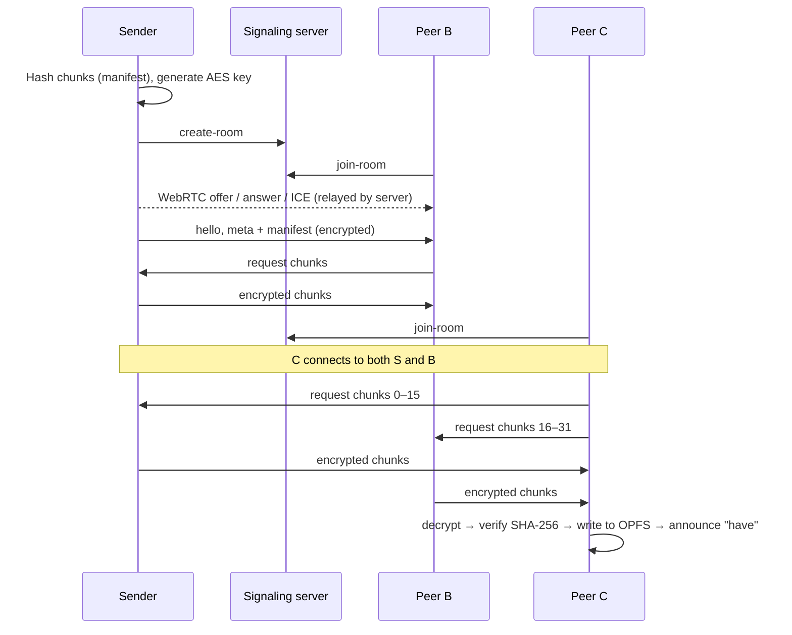

# P2P Web Share

**Decentralized, end-to-end encrypted file sharing that runs entirely in the browser.**

Drop a file, get an invite link, and anyone who opens it downloads the file directly from your browser, and from every other peer downloading it. There's no upload server and no account. A small Node.js/Socket.io signaling server introduces the peers, then gets out of the way: it never sees file data, file names or encryption keys.

| | |
| --- | --- |
| 🌐 **Live demo** | _add your Render URL here_ |
| 🎬 **Demo video** | _add your YouTube / Google Drive link here_ |

---

## Highlights

- **WebRTC data channels:** files travel browser-to-browser; a Node.js + Socket.io server only handles the connection handshake.
- **SHA-256 chunk verification:** every 128 KB chunk is checked against the sender's hash manifest, whichever peer delivered it.
- **Zero-knowledge AES-256-GCM encryption:** the key lives only in the link's `#fragment`, which browsers never send to a server.
- **Multi-peer mesh swarming:** a new peer downloads different chunks from the sender *and* from other peers at the same time.
- **Large files (>500 MB) via OPFS:** incoming chunks stream straight to disk, so RAM stays flat whatever the file size.
- **Churn recovery and auto-resume:** after a dropped connection, a closed tab or a refresh, the download picks up from the last verified chunk instead of 0%.

---

## How It Works

### 1. Rooms and signaling

The sender's browser creates a room and gets an invite link:

```
https://<host>/?room=5d0a8f18#key=B4tjWvIA2qzMQNz4fFCri3_F9xS0NkRDnHgmzNnYrwo
                └── room id ─┘     └────────── AES-256 key (never leaves the browser) ──────────┘
```

Peers that open the link join the room through the signaling server, which relays WebRTC offers, answers and ICE candidates to the right peer. Every peer then opens a direct WebRTC connection to every other peer, forming a full mesh of up to 8 peers. The server only ever sees opaque room and peer ids.

### 2. Encryption (zero-knowledge)

- The sender generates an **AES-256-GCM** key with the Web Crypto API.
- The key is placed after `#` in the link. Browsers never include the fragment in HTTP requests, so it can't reach the server, its logs, or anything in between.
- **Every** frame on a data channel is encrypted: file chunks and control messages alike.
- Each chunk's index is bound as authenticated data, so a chunk can't be swapped for another or replayed under a different index.
- A wrong or missing key is detected on the first message and reported clearly.

### 3. Integrity (SHA-256 manifest)

Before sharing, the sender hashes the file in 128 KB chunks. The resulting **manifest** (name, size and the SHA-256 of every chunk) is sent to each peer, encrypted. The `fileId` is a hash of all the chunk hashes, so the manifest itself is verifiable.

Every received chunk is decrypted and its SHA-256 compared with the manifest before it's stored, whether it came from the sender or from another peer. A peer that sends 3 corrupt chunks is disconnected.

### 4. Mesh swarming (pull-based, like BitTorrent)

- Every peer keeps a **bitfield**, one bit per chunk, of what it has verified, and announces new chunks to the swarm (`have` messages).
- Downloaders **request** missing chunks from every connected peer that has them, pipelining up to 16 chunks per peer.
- A peer that has downloaded part of the file immediately serves those parts to others. When a third peer joins mid-transfer, it downloads different chunks from the sender and from the second peer at the same time.
- Finished peers keep seeding while their tab stays open.

### 5. Large files with OPFS

Holding a 2 GB file in memory crashes a browser tab. Receivers instead write each verified chunk directly into the **Origin Private File System**, using a `FileSystemSyncAccessHandle` inside a dedicated Web Worker that writes at each chunk's offset. The finished download is a disk-backed file, and seeding to other peers reads chunks back from disk.

> Measured: a **600 MB** transfer arrived byte-identical while the receiver's JS heap peaked at **~6 MB**.

If a browser lacks OPFS, the app falls back to memory storage for files up to 500 MB, and checks free storage up front with a clear error message.

### 6. Churn recovery and auto-resume

- **State tracking:** the receiver's verified-chunk bitfield is saved next to the partial OPFS file. It's flushed to disk before every save and written once more when the tab closes.
- **Reconnect handshake:** whenever two peers connect, they exchange bitfields first, so only missing chunks are requested and nothing already verified is fetched again.
- **Receiver refreshes or reopens the link:** verified chunks are restored from disk ("Resumed from your last session: N chunks") and the download continues.
- **Peer link drops:** it's retried automatically with exponential backoff (1–10 s). Direct links keep transferring even while the signaling server is unreachable.
- **Sender refreshes:** the page offers **Resume sharing**. After the sender re-selects the same file (checked by its hashes), they take the room back over with the same key, and receivers continue from where they paused.
- The server keeps empty rooms for 30 minutes so peers have time to come back.

### Wire protocol

| Message | Purpose |
| --- | --- |
| `hello` | First message on every link: peer id, whether it knows the file, its bitfield |
| `meta` + `manifest` | File metadata and the SHA-256 of every chunk |
| `bitfield` / `have` | Which chunks a peer has verified (full list / new ones) |
| `request` | "Send me these chunk indices" |
| chunk frame | `[0x02][index][IV][AES-GCM ciphertext]` |



---

## Tech Stack

| Layer | Technology |
| --- | --- |
| Frontend | React 19, Vite, Tailwind CSS 4 |
| Peer-to-peer | WebRTC `RTCPeerConnection` + `RTCDataChannel` (no wrapper library) |
| Cryptography | Web Crypto API: AES-256-GCM, SHA-256 |
| Storage | Origin Private File System (sync access handles in a Web Worker) |
| Signaling | Node.js, Express, Socket.io |
| Hosting | Render (single service serves the app and the signaling server) |

## Project Structure

```text
client/src/
├── App.jsx                  Sender and receiver pages
├── hooks/useSwarm.js        React bindings for the swarm engine
├── components/              Drop zone, status and progress panels, swarm list
└── lib/
    ├── swarm.js             Swarm engine: mesh, scheduling, verification, seeding, resume
    ├── peerLink.js          One RTCPeerConnection + data channel per remote peer
    ├── protocol.js          Encrypted frame format
    ├── crypto.js            AES-GCM keys, encryption, SHA-256, invite links
    ├── manifest.js          Chunk hashing
    ├── bitfield.js          Compact verified-chunk sets
    ├── stores.js            Chunk storage: source file, OPFS, memory
    ├── opfs.worker.js       OPFS disk writes (Web Worker)
    ├── resume.js            Persisted resume state
    ├── signaling.js         Socket.io client helpers
    └── config.js            Tunables, ICE servers, signaling URL
server/index.js              Signaling server: rooms, signal relay, reconnection
render.yaml                  Render deployment blueprint
```

---

## Running Locally

Requires **Node.js 18+**.

```bash
git clone https://github.com/AltamashZahid/p2p-share-files.git
cd p2p-share-files
npm run install:all     # install server and client dependencies

npm run dev:server      # terminal 1: signaling server on http://localhost:3001
npm run dev:client      # terminal 2: app on http://localhost:5173
```

Open **http://localhost:5173**. To simulate several peers on one computer, use a **separate browser or profile for each peer** (e.g. Chrome, Chrome Incognito and Edge); windows in the same profile share storage.

> `localhost` only works on the machine running the dev server. Browsers allow Web Crypto and OPFS only on HTTPS or `localhost`, so to test across devices, use the deployed HTTPS site.

### Production build

```bash
npm run build   # builds client/dist
npm start       # server serves the app + signaling on http://localhost:3001
```

## Deployment (Render, free plan)

The repo includes a `render.yaml` blueprint that runs everything as **one free web service**: the server serves the built frontend and the signaling endpoint from the same origin, so no environment variables are needed.

1. On [Render](https://dashboard.render.com), choose **New + → Blueprint** and select this repository (`main` branch).
2. Apply. Render builds the client, starts the server, and gives you an `https://…onrender.com` URL.
3. Visit `/health` to check: `{"status":"ok", …}`.

Free services sleep after ~15 minutes of inactivity; the first request afterwards takes up to a minute while it wakes.

**Split deployment (optional):** deploy `client/` to Vercel or Netlify with `VITE_SIGNALING_URL` pointing to the server, and `server/` to Render or Railway with `CLIENT_ORIGIN` set to the frontend URL.

## Configuration

| Variable | Where | Purpose |
| --- | --- | --- |
| `VITE_SIGNALING_URL` | client | Signaling server URL (only for split deployments) |
| `VITE_TURN_URL` | client | Optional TURN server(s), comma-separated, for networks that block direct connections |
| `VITE_TURN_USERNAME` / `VITE_TURN_CREDENTIAL` | client | TURN credentials |
| `PORT` | server | Listen port (default `3001`) |
| `CLIENT_ORIGIN` | server | Allowed CORS origin(s), comma-separated |

See `client/.env.example` and `server/.env.example`.

---

## Try Each Feature

| Feature | How to see it |
| --- | --- |
| Basic transfer | Drop a file → **Create share room** → open the link in another browser. Progress, speed and "X/Y chunks verified" update live, then the file downloads automatically. |
| Encryption | The link ends in `#key=…`. Change a character of the key and open it: you get "Could not decrypt… wrong #key". Remove the key: "link is missing its decryption key". |
| Mesh swarming | Share a 300 MB+ file. Open the link in browser B; at ~25%, open it in browser C. C's **Swarm** list shows bytes arriving (↓) from both **Sender** and **Peer**. |
| Large files / OPFS | Share a file over 500 MB. The receiver shows **💾 Streaming to disk (OPFS)**, and its memory in Chrome's Task Manager (Shift+Esc) stays flat. |
| Receiver resume | Press F5 on the receiver mid-download: "↻ Resumed from your last session: N of M chunks restored". |
| Sender resume | Refresh the sender mid-transfer. The receiver shows **Paused**; the sender sees **Resume sharing?**. Re-select the same file and the receiver continues where it stopped. |
| Disconnect handling | Close any tab mid-transfer. The others show **Reconnecting / Left / Paused** with an explanation instead of freezing. |

To confirm a download is byte-identical, compare hashes:

```powershell
Get-FileHash .\original.bin -Algorithm SHA256
Get-FileHash $HOME\Downloads\original.bin -Algorithm SHA256
```

---

## Limitations

- **Signaling is centralized:** peers need the server to find each other initially, although established peer links keep working while it's unreachable.
- **Up to 8 peers per room:** a full mesh grows quadratically.
- **One file per room:** to share another file, stop sharing and create a new room (new link, new key).
- **Restrictive networks:** without a TURN server (`VITE_TURN_URL`), peers behind strict NATs or firewalls may not connect.
- **Large files** need OPFS (Chrome, Edge, Firefox, Safari 17+) and free disk space. Private/incognito windows have small storage quotas.
- **Sender resume** requires re-selecting the file, because browsers don't let a page reopen a local file on its own.

## License

MIT
