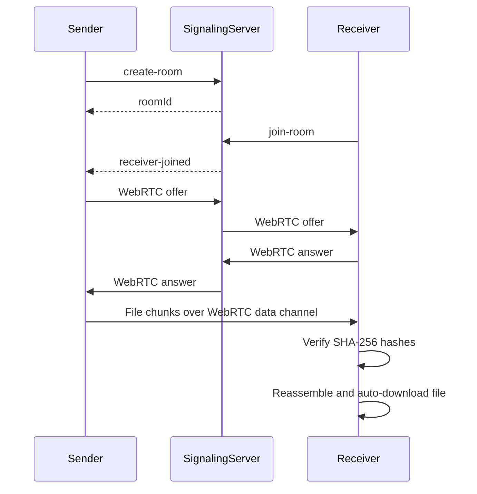

# P2P Web Share

A lightweight browser-to-browser file sharing app built with React, Node.js, Socket.io, and WebRTC.

Users can select a file, generate a share room link, send that link to another person, and transfer the file directly between browsers using a WebRTC data channel. The signaling server is used only for the initial WebRTC handshake and never stores, reads, or processes file data.

## Features

- Drag-and-drop file selection.
- File size limit under 50 MB.
- Unique share room link generation.
- Socket.io signaling server for WebRTC offer, answer, and ICE candidate exchange.
- Direct peer-to-peer transfer using WebRTC data channels.
- SHA-256 chunk verification for transfer integrity.
- Transfer progress indicator.
- Transfer speed display.
- Connection status display.
- Graceful disconnect handling.
- Automatic file download on the receiver side.

## Tech Stack

| Layer | Technology |
| --- | --- |
| Frontend | React, Vite, Tailwind CSS |
| Backend | Node.js, Express.js, Socket.io |
| P2P Transfer | WebRTC Data Channels |
| File Integrity | Web Crypto API, SHA-256 |

## Project Structure

```text
p2p-web-share/
|-- client/              React frontend
|-- server/              Node.js signaling server
|-- SUBMISSION_NOTES.md  Assignment and submission notes
|-- package.json         Root helper scripts
`-- README.md
```

## Local Setup

### Prerequisites

- Node.js 18 or newer
- npm

### Install Dependencies

From the project root:

```bash
npm run install:all
```

Or install manually:

```bash
cd server
npm install

cd ../client
npm install
```

### Start The Backend

From the project root:

```bash
npm run dev:server
```

The signaling server runs at:

```text
http://localhost:3001
```

Health check:

```text
http://localhost:3001/health
```

### Start The Frontend

Open a second terminal from the project root:

```bash
npm run dev:client
```

The frontend runs at:

```text
http://localhost:5173
```

If localhost does not open correctly on Windows, use:

```text
http://127.0.0.1:5173
```

## How To Use

1. Open the frontend in one browser window.
2. Drop or select a file under 50 MB.
3. Click **Create share room**.
4. Copy the generated invite link.
5. Open the invite link in another browser window or another device.
6. Wait for the peer connection.
7. The receiver will automatically download the file after all chunks are verified.

## How It Works



## Environment Variables

### Frontend

Create `client/.env` if you want to override the signaling server URL:

```text
VITE_SIGNALING_URL=http://localhost:3001
```

### Backend

Create `server/.env` if needed:

```text
PORT=3001
CLIENT_ORIGIN=http://localhost:5173
```

`CLIENT_ORIGIN` can also be a comma-separated list:

```text
CLIENT_ORIGIN=http://localhost:5173,http://127.0.0.1:5173
```

## Build

From the project root:

```bash
npm run build
```

This builds the frontend production files inside:

```text
client/dist
```

## Deployment

Recommended hosting:

- Frontend: Vercel or Netlify.
- Backend: Render or Railway.

### Frontend Deployment

Use these settings for the `client` folder:

```text
Build command: npm run build
Output directory: dist
```

Set this environment variable to your deployed backend URL:

```text
VITE_SIGNALING_URL=https://your-backend-url
```

### Backend Deployment

Use these settings for the `server` folder:

```text
Start command: npm start
```

Set these environment variables:

```text
PORT=3001
CLIENT_ORIGIN=https://your-frontend-url
```

## Submission Checklist

- [x] React frontend
- [x] Node.js + Socket.io signaling server
- [x] WebRTC data channel transfer
- [x] Room creation and join flow
- [x] SHA-256 chunk verification
- [x] Progress tracking UI
- [x] Connection status UI
- [x] Graceful disconnect handling
- [x] Auto download on receiver side
- [x] README.md
- [ ] Deployment links
- [ ] Demo video

## Demo Video Requirement

The project submission should include a demo video of about 3 minutes showing:

- File selection.
- Share link generation.
- Receiver joining from another browser window or device.
- Live transfer progress.
- Automatic download after completion.

The video can be uploaded to YouTube or Google Drive.

## Important Note

The signaling server only handles WebRTC connection setup. File data is transferred directly between browsers over WebRTC and is not uploaded to the server.

## License

MIT
