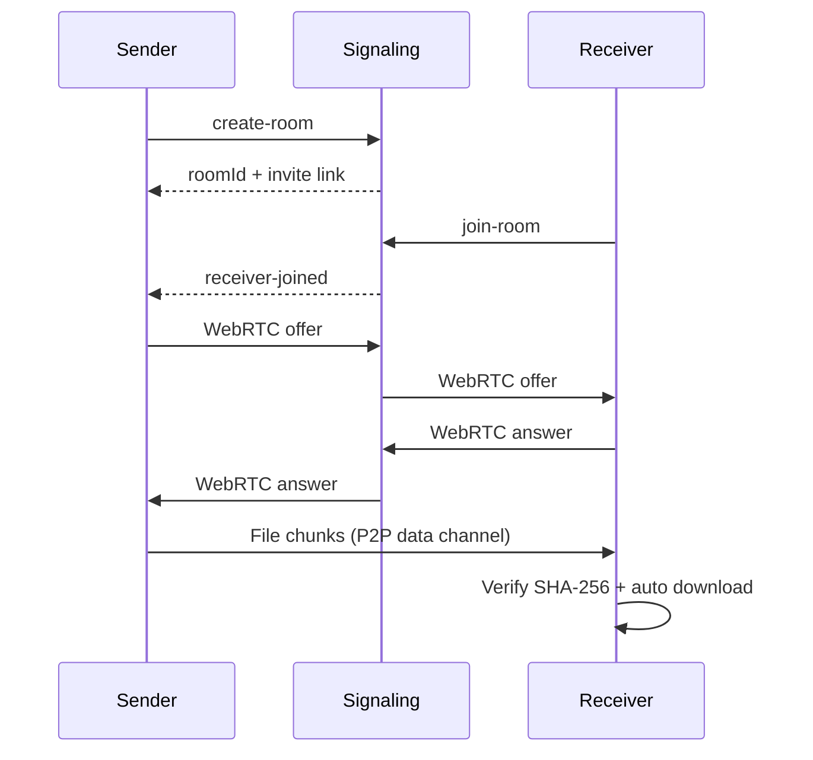

# P2P Web Share

A lightweight, decentralized peer-to-peer file-sharing web app. Users drop a file, generate a share room link, and recipients download it directly from the sender's browser using **WebRTC data channels**. A small **Node.js + Socket.io** signaling server handles only the WebRTC handshake — it never reads, stores, or processes file data.

## Features

- Drag-and-drop file upload (max 50 MB)
- Unique room links for one-to-one sharing
- Direct browser-to-browser transfer via WebRTC
- SHA-256 hash verification per chunk
- Real-time progress, speed, and connection status
- Graceful disconnect handling
- Automatic download on the receiver side

## Tech Stack

| Layer | Technologies |
|-------|--------------|
| Frontend | React, Vite, Tailwind CSS |
| P2P | WebRTC Data Channels |
| Signaling | Node.js, Express, Socket.io |

## Project Structure

```
p2p-web-share/
├── client/          # React frontend
├── server/          # Socket.io signaling server
└── README.md
```

## Local Setup

### Prerequisites

- Node.js 18+
- npm

### 1. Install dependencies

```bash
cd server
npm install

cd ../client
npm install
```

### 2. Configure environment

```bash
cp server/.env.example server/.env
cp client/.env.example client/.env
```

### 3. Start the signaling server

```bash
cd server
npm run dev
```

Server runs at `http://localhost:3001`.

### 4. Start the frontend

```bash
cd client
npm run dev
```

App runs at `http://localhost:5173`.

## How to Use

1. Open `http://localhost:5173` in one browser window.
2. Drop a file and click **Create share room**.
3. Copy the invite link.
4. Open the link in a second browser window or device.
5. Watch the transfer progress and let the receiver auto-download the file.

## Deployment

### Frontend (Vercel / Netlify)

- Build command: `npm run build`
- Output directory: `dist`
- Set `VITE_SIGNALING_URL` to your deployed signaling server URL.

### Backend (Render / Railway)

- Start command: `npm start`
- Set `CLIENT_ORIGIN` to your deployed frontend URL.
- Expose port via `PORT` environment variable.

## Architecture



## Submission Checklist

- [x] React frontend
- [x] Node.js + Socket.io signaling server
- [x] WebRTC data channel transfer
- [x] Room creation and join flow
- [x] SHA-256 chunk verification
- [x] Progress tracking UI
- [x] Connection status UI
- [x] Graceful disconnect handling
- [x] Auto download on receiver
- [x] README.md
- [ ] Deployment links
- [ ] Demo video

## License

MIT
