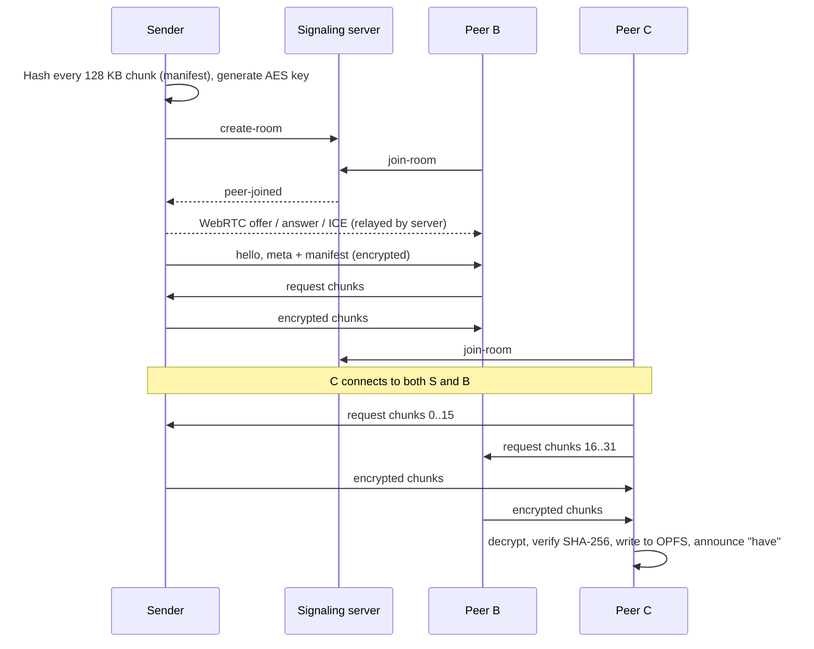

# P2P Web Share

A decentralized, end-to-end encrypted file-sharing web app. Files move directly between browsers over WebRTC data channels; a lightweight Node.js/Socket.io signaling server only introduces peers and never reads, processes or stores file data.

- **Live demo:** _add your deployment URL here_
- **Demo video:** _add your YouTube / Google Drive link here_

## Features

**Core**

- Drag-and-drop (or click-to-browse) file selection and a unique invite link per room.
- Node.js + Express + Socket.io signaling server that relays WebRTC offers, answers and ICE candidates.
- Direct browser-to-browser transfer over WebRTC data channels, with backpressure.
- SHA-256 verification of every chunk against the sender's manifest.
- Live progress, download/upload speed, verified-chunk counter and connection status.
- Graceful handling of closed tabs and dropped connections, with clear status messages.
- Automatic download once every chunk is verified.

**Advanced**

| Feature | How it works |
| --- | --- |
| **Zero-knowledge encryption** | The sender's browser generates an AES-256-GCM key (Web Crypto API). Every chunk and control message is encrypted before it enters a data channel, with the chunk index bound as authenticated data. The key only travels in the link's fragment (`/?room=<id>#key=<key>`), which browsers never send to any server. |
| **Multi-peer mesh swarming** | Every peer in a room connects to every other peer. Transfers are pull-based, like BitTorrent: each peer tracks a bitfield of verified chunks and announces new ones, and downloaders request different chunks from every peer that has them. A third peer downloads from the sender *and* the second peer at the same time. |
| **Large files (>500 MB) via OPFS** | Receivers stream verified chunks straight to disk in the Origin Private File System, using `FileSystemSyncAccessHandle` in a worker. RAM use stays flat (a 600 MB transfer peaked at ~6 MB of JS heap), and the final download is a disk-backed file. |
| **Churn recovery / auto-resume** | Receivers persist their verified-chunk bitfield next to the OPFS file. After a dropped connection, a refresh, or the sender coming back, the bitfield handshake resumes from the last verified chunk instead of 0%. Broken peer links retry with backoff, and the sender can refresh, re-select the same file and take its room back over. |

## Tech Stack

| Layer | Technology |
| --- | --- |
| Frontend | React 19, Vite, Tailwind CSS 4 |
| P2P | WebRTC `RTCPeerConnection` + `RTCDataChannel` (no wrapper library) |
| Crypto | Web Crypto API: AES-256-GCM, SHA-256 |
| Storage | Origin Private File System (sync access handles in a Web Worker) |
| Signaling | Node.js, Express, Socket.io |

## How It Works



### Protocol

All frames on a data channel are encrypted. Control frames carry JSON; chunk frames carry `[index][iv][AES-GCM ciphertext]`.

| Message | Purpose |
| --- | --- |
| `hello` | First message on every link: peer id, whether it knows the file, its bitfield |
| `meta` + `manifest` | File name/size/chunk count and the SHA-256 of every chunk; `fileId` = hash of all hashes |
| `bitfield` / `have` | Which chunks a peer has verified (full / incremental) |
| `request` | "Send me these chunk indices" (up to 16 in flight per peer) |

### Project Structure

```text
client/src/
|-- App.jsx                 Sender and receiver pages
|-- hooks/useSwarm.js       React bindings for the swarm engine
|-- components/             Drop zone, status/progress panels, peer list
`-- lib/
    |-- swarm.js            Swarm engine: mesh, scheduling, verification, seeding, resume
    |-- peerLink.js         One RTCPeerConnection + data channel per remote peer
    |-- protocol.js         Encrypted frame format
    |-- crypto.js           AES-GCM key handling, encryption, SHA-256, link parsing
    |-- manifest.js         Chunk hashing
    |-- bitfield.js         Compact verified-chunk sets
    |-- stores.js           Source file / OPFS / in-memory chunk stores
    |-- opfs.worker.js      OPFS sync access handles (disk streaming)
    |-- resume.js           Persisted resume state
    |-- signaling.js        Socket.io client helpers
    `-- config.js           Tunables, ICE servers, signaling URL
server/index.js             Signaling server (rooms, relay, reconnection)
```

## Local Setup

Requires Node.js 18+.

```bash
npm run install:all   # install server and client dependencies
npm run dev:server    # signaling server on http://localhost:3001
npm run dev:client    # frontend on http://localhost:5173 (second terminal)
```

Open http://localhost:5173, drop a file, click **Create share room**, then open the invite link in other browser windows or on other devices. Open the link in a third window while the second is still downloading to see swarming in the peer list.

## Configuration

### Frontend (`client/.env`)

| Variable | Default | Purpose |
| --- | --- | --- |
| `VITE_SIGNALING_URL` | same origin (prod) / `:3001` (dev) | Signaling server URL for split deployments |
| `VITE_TURN_URL` | none | Optional TURN server(s), comma-separated, for networks that block direct connections |
| `VITE_TURN_USERNAME`, `VITE_TURN_CREDENTIAL` | none | TURN credentials |

### Backend (`server/.env`)

| Variable | Default | Purpose |
| --- | --- | --- |
| `PORT` | `3001` | Listen port |
| `CLIENT_ORIGIN` | any | Allowed CORS origin(s), comma-separated |

## Deployment

**Single service on Render (recommended).** `render.yaml` builds the frontend and serves it from the signaling server, so both share one origin and no environment variables are needed. Create a new Blueprint on Render pointing at this repository.

**Split deployment.** Deploy `client/` to Vercel or Netlify (build `npm run build`, output `dist`, set `VITE_SIGNALING_URL`), and `server/` to Render or Railway (start `npm start`, set `CLIENT_ORIGIN`).

## Browser Support & Limits

- Chrome, Edge, Firefox and Safari 17+. OPFS streaming needs sync access handles; browsers without them fall back to in-memory storage, capped at 500 MB.
- Rooms hold up to 8 peers (full mesh). Empty rooms are kept for 30 minutes so peers can come back and resume.
- Without a TURN server, peers behind strict NATs or firewalls may be unable to connect directly.

## License

MIT
